### Course Content
| Section | Content Name                                                      | Duration   |
|---------|-------------------------------------------------------------------|------------|
| 1       | Welcome, Welcome, Welcome!                                        | 3min       |
| 2       | PART 1: REACT FUNDAMENTALS (4 PROJECTS)                           | 35min      |
| 3       | A First Look at React                                             | 1hr 15min  |
| 4       | [Optional] Review of Essential JavaScript for React               | 1hr 55min  |
| 5       | Working With Components, Props, and JSX                           | 1hr 45min  |
| 6       | State, Events, and Forms: Interactive Components                  | 1hr 28min  |
| 7       | Thinking in React State Management                                | 1hr 40min  |
| 8       | [Optional] Practice Project: Eat-N-Split                          | 1hr 15min  |
| 9       | PART 2: INTERMEDIATE REACT (2 PROJECTS)                           | 21hr 42min |
| 10      | Thinking in React: Components, Composition, and Reusability       | 1hr 39min  |
| 11      | How React Works Behind the Scenes                                 | 1hr 36min  |
| 12      | Effects and Data Fetching                                         | 1hr 42min  |
| 13      | Custom Hooks, Refs, and More State                                | 1hr 29min  |
| 14      | [Optional] React Before Hooks: Class-Based React                  | 1hr 27min  |
| 15      | PART 3: ADVANCED REACT + REDUX (4 PROJECTS)                       | 22hr 17min |
| 16      | The Advanced useReducer Hook                                      | 1hr 13min  |
| 17      | React Router: Building Single-Page Applications (SPA)             | 1hr 41min  |
| 18      | Advanced State Management: The Context API                        | 2hr 24min  |
| 19      | Performance Optimization and Advanced useEffect                   | 1hr 25min  |
| 20      | Redux and Modern Redux Toolkit (with Thunks)                      | 1hr 39min  |
| 21      | PART 4: PROFESSIONAL REACT DEVELOPMENT (2 PROJECTS)               | 21hr 26min |
| 22      | React Router With Data Loading (v6.4+)                            | 3hr 57min  |
| 23      | [Optional] Tailwind CSS Crash Course: Styling the App             | 1hr 39min  |
| 24      | Adding Redux and Advanced React Router                            | 1hr 24min  |
| 25      | Setting Up Our Biggest Project + Styled Components                | 11hr 50min |
| 26      | Supabase Crash Course: Building a Back-End                        | 1hr 59min  |
| 27      | React Query: Managing Remote State                                | 3hr 52min  |
| 28      | Advanced React Patterns                                           | 1hr 44min  |
| 29      | [Optional] Implementing More Features: Authentication, Dark Mode… | 3hr 57min  |
| 30      | Deployment With Netlify and Vercel                                | 34min      |
| 31      | PART 5: FULL-STACK REACT WITH NEXT.JS (1 PROJECT)                 | 12hr 12min |
| 32      | Overview of Next.js With the “App” Router                         | 1hr 23min  |
| 33      | Starting to Build the “Wild Oasis” Website                        | 1hr 40min  |
| 34      | Data Fetching, Caching, and Rendering                             | 1hr 48min  |
| 35      | Client and Server Interactions                                    | 2hr 29min  |
| 36      | Authentication With NextAuth (Auth.js)                            | 1hr 23min  |
| 37      | Mutations With Server Actions + Modern React Hooks                | 1hr 37min  |
| 38      | Deployment With Vercel                                            | 14min      |
| 39      | [Optional] Legacy Next.js: The “Pages” Router                     | 1hr 28min  |
| 40      | The End!                                                          | 11min      |

```mermaid
graph TD
    A(["Welcome, Welcome, Welcome!<br/>3min"]):::completed
    B(["PART 1: REACT FUNDAMENTALS (4 PROJECTS)<br/>35min"]):::completed
    C(["A First Look at React<br/>1hr 15min"]):::completed
    D(["[Optional] Review of Essential JavaScript for React<br/>1hr 55min"]):::current
    E(["Working With Components, Props, and JSX<br/>1hr 45min"]):::pending
    F(["State, Events, and Forms: Interactive Components<br/>1hr 28min"]):::pending
    G(["Thinking in React State Management<br/>1hr 40min"]):::pending
    H(["[Optional] Practice Project: Eat-N-Split<br/>1hr 15min"]):::pending
    I(["PART 2: INTERMEDIATE REACT (2 PROJECTS)<br/>21hr 42min"]):::pending
    J(["Thinking in React: Components, Composition, and Reusability<br/>1hr 39min"]):::pending
    K(["How React Works Behind the Scenes<br/>1hr 36min"]):::pending
    L(["Effects and Data Fetching<br/>1hr 42min"]):::pending
    M(["Custom Hooks, Refs, and More State<br/>1hr 29min"]):::pending
    N(["[Optional] React Before Hooks: Class-Based React<br/>1hr 27min"]):::pending
    O(["PART 3: ADVANCED REACT + REDUX (4 PROJECTS)<br/>22hr 17min"]):::pending
    P(["The Advanced useReducer Hook<br/>1hr 13min"]):::pending
    Q(["React Router: Building Single-Page Applications (SPA)<br/>1hr 41min"]):::pending
    R(["Advanced State Management: The Context API<br/>2hr 24min"]):::pending
    S(["Performance Optimization and Advanced useEffect<br/>1hr 25min"]):::pending
    T(["Redux and Modern Redux Toolkit (with Thunks)<br/>1hr 39min"]):::pending
    U(["PART 4: PROFESSIONAL REACT DEVELOPMENT (2 PROJECTS)<br/>21hr 26min"]):::pending
    V(["React Router With Data Loading (v6.4+)<br/>3hr 57min"]):::pending
    W(["[Optional] Tailwind CSS Crash Course: Styling the App<br/>1hr 39min"]):::pending
    X(["Adding Redux and Advanced React Router<br/>1hr 24min"]):::pending
    Y(["Setting Up Our Biggest Project + Styled Components<br/>11hr 50min"]):::pending
    Z(["Supabase Crash Course: Building a Back-End<br/>1hr 59min"]):::pending
    AA(["React Query: Managing Remote State<br/>3hr 52min"]):::pending
    AB(["Advanced React Patterns<br/>1hr 44min"]):::pending
    AC(["[Optional] Implementing More Features: Authentication, Dark Mode…<br/>3hr 57min"]):::pending
    AD(["Deployment With Netlify and Vercel<br/>34min"]):::pending
    AE(["PART 5: FULL-STACK REACT WITH NEXT.JS (1 PROJECT)<br/>12hr 12min"]):::pending
    AF(["Overview of Next.js With the 'App' Router<br/>1hr 23min"]):::pending
    AG(["Starting to Build the 'Wild Oasis' Website<br/>1hr 40min"]):::pending
    AH(["Data Fetching, Caching, and Rendering<br/>1hr 48min"]):::pending
    AI(["Client and Server Interactions<br/>2hr 29min"]):::pending
    AJ(["Authentication With NextAuth (Auth.js)<br/>1hr 23min"]):::pending
    AK(["Mutations With Server Actions + Modern React Hooks<br/>1hr 37min"]):::pending
    AL(["Deployment With Vercel<br/>14min"]):::pending
    AM(["[Optional] Legacy Next.js: The 'Pages' Router<br/>1hr 28min"]):::pending
    AN(["The End!<br/>11min"]):::pending

    A --> B
    B --> C
    C --> D
    D --> E
    E --> F
    F --> G
    G --> H
    H --> I
    I --> J
    J --> K
    K --> L
    L --> M
    M --> N
    N --> O
    O --> P
    P --> Q
    Q --> R
    R --> S
    S --> T
    T --> U
    U --> V
    V --> W
    W --> X
    X --> Y
    Y --> Z
    Z --> AA
    AA --> AB
    AB --> AC
    AC --> AD
    AD --> AE
    AE --> AF
    AF --> AG
    AG --> AH
    AH --> AI
    AI --> AJ
    AJ --> AK
    AK --> AL
    AL --> AM
    AM --> AN

    classDef completed fill:#28a745,stroke:#1e7e34,stroke-width:3px,color:#fff
    classDef current fill:#ffc107,stroke:#e0a800,stroke-width:3px,color:#000
    classDef pending fill:#6c757d,stroke:#495057,stroke-width:2px,color:#fff
```

